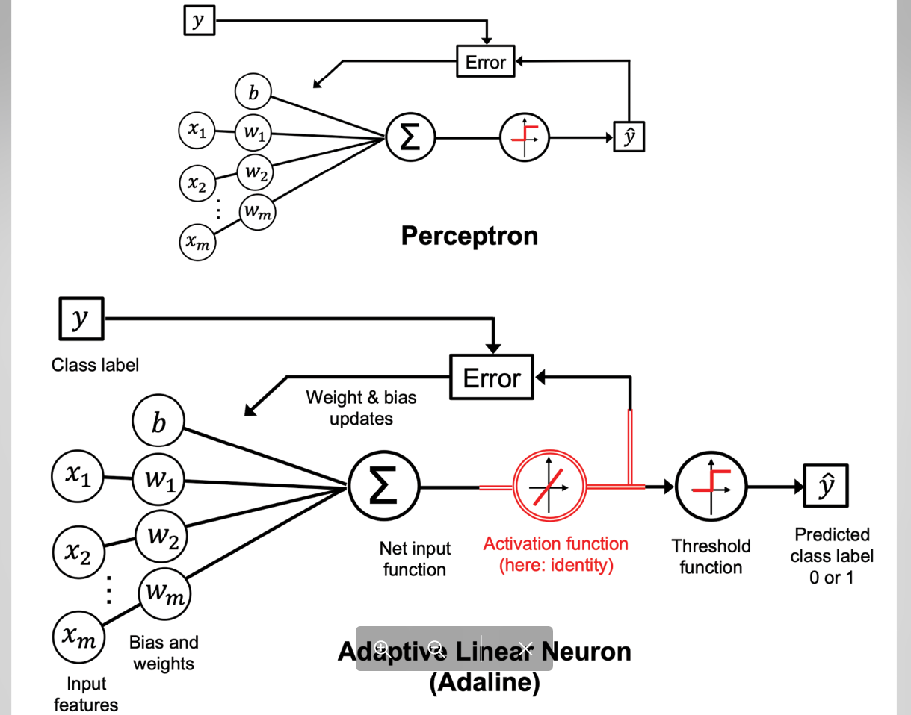
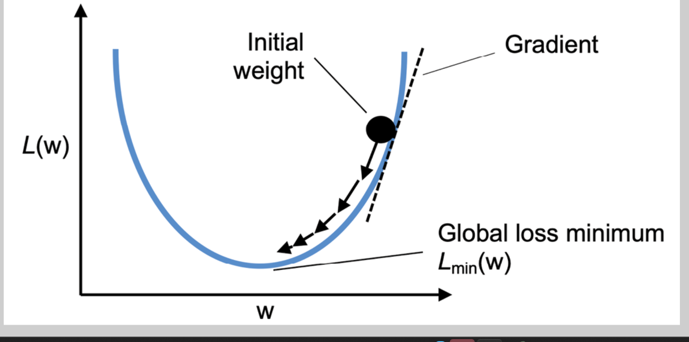
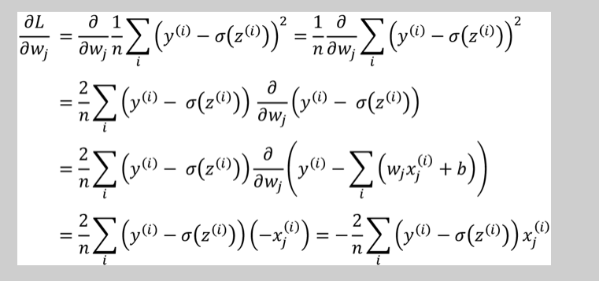

# Hands_on_MachineLearning
# Perceptron Learning Algorithm

The perceptron learning rule

# Adaline Algorithm Rule

-- Difference between Adaline and Perceptron

-- Using Gradient Descend Rule

-- Mean Square Error Derivative

